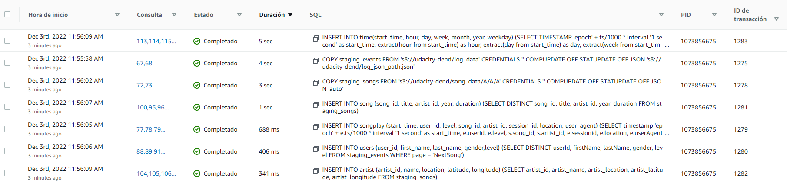
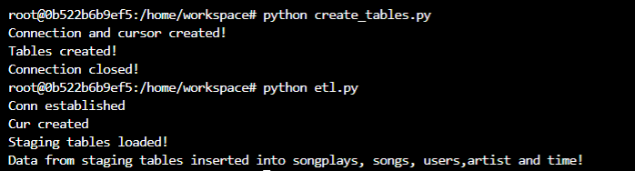
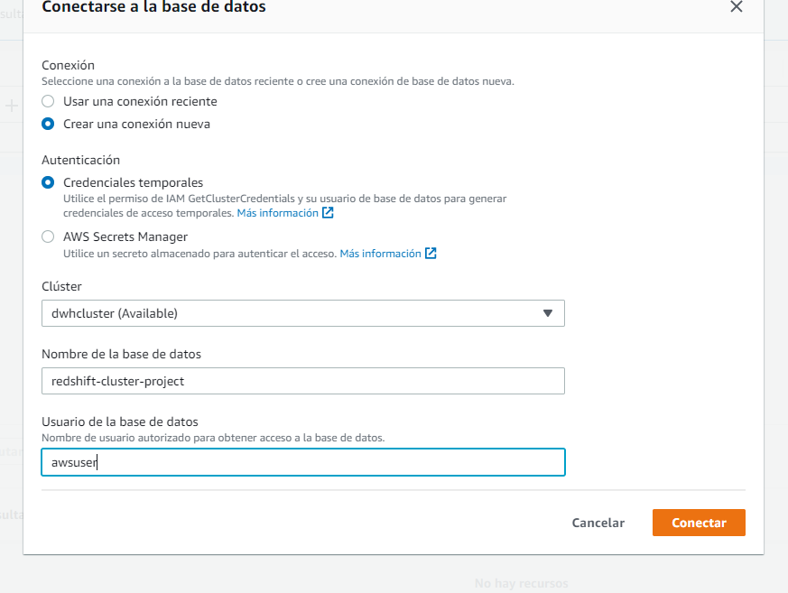
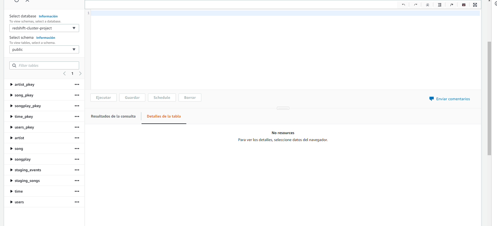

# PROJECT 3: SPARKIFY DATA WAREHOUSE 
 
**Author:** Judith Gil Maroto

**Project GitHub Repo:** https://github.com/judithgm/Project-3-Redshift-Data-Warehouse-Udacity.git

### Datasets
**The original JSON files with song and log data reside in Udacity S3 directories. Here are the S3 links for each:**

- **Song data:** *s3://udacity-dend/song_data:* (10 fields): Metadata about songs and the artists of that songs
- **Log data:** *s3://udacity-dend/log_data:* (18 fields): Log files in JSON format generated by this event simulator based on the songs in the dataset above.

Also, Udacity gives an extra link with another json file, *log_json_path.json'*, that will be used in the COPY statement when creating the **staging_events** table, because the table column headers don't match the JSON keys, so we need to parse this data: 

- **Log data json path:** s3://udacity-dend/log_json_path.json

### Staging tables and target analytic tables

#### Staging tables

Firstly, the data inside song data JSON files, is loaded into the **staging_songs** table
Then, the data inside log data JSON files, is loaded into the **staging_events** table

Then, we insert the data into the correspondent tables by making queries from the staging tables with the necessary fields and conditions:

#### Schema for 'output' analytic tables

**Fact Table**

- **songplays** - records in event data associated with song plays  with page NextSong(*songplay_id, start_time, user_id, level, song_id, artist_id, session_id, location, user_agent*)

**Dimension Tables**

- **users** - users in the app (*user_id, first_name, last_name, gender, level*)

- **songs** - songs in music database (*song_id, title, artist_id, year, duration*)

- **artists** - artists in music database (*artist_id, name, location, lattitude, longitude*)

- **time** - timestamps of records in songplays broken down into specific units (*start_time, hour, day, week, month, year, weekday*)

### Scripts explanation in order of execution

All parameters in the configuration file *dwh.cfg* necessary for the execution of the scripts must be pre-filled, at least those that can be filled in at the beginning:

- AWS keys to be able to work with the provided AWS account.
- Cluster and database characteristics
- Storage paths of the original data in S3

**1 - *IaC_SetupCluster_and_permissions.ipynb***:

This is a 'custom' script, not given by Udacity , in which we use the concept of IaC (Infrastructure as Code) to set up the redshift cluster, with the boto3 connector between Python and AWS

In the script, after loading the configuration parameters and creating the clients (objects) for IAM, Redshift, EC2 and S3:

- An IAM Role must be created to allow Redshift to access S3 buckets, and add an access policy to S3 with Read-Only permissions.
    Once the role is created, an ARN is generated and added to the configuration file as a parameter.

- Then, the Redshift cluster is created, according to the parameters of dwh.cfg. Once the cluster is created, an endpoint is generated, whose address is stored in the configuration file under the parameter 'HOST'.

**2 - *sql_queries.py***

In this script, the creation, insertion and deletion statements of the tables are introduced, as well as the order of the events. These statements will be applied later in the *create_tables.py* (create, drop) and *etl.py* (copy, insert) scripts.

The **staging_songs** and **staging_events** tables have a special procedure for data insertion, as they take the data from JSON files in S3, so the data will be inserted using the **COPY** command.

**3 - *create_tables.py***

This script is used to connect to the database, and create the necessary tables inside, for the moment, with no content. Each table is deleted every time we
execute the script in order to avoid inserting the same data multiple times.

**4 - *etl.py***

- The next execution step is to compile the **etl.py** script to insert the generated tables into the *redshift-cluster-project* database of the newly created Redshift cluster.

The logs in the Redshift console give us some information about the processes that have been running:

**Logs terminal:**

 

**5 - Finally, to check that the data has been inserted correctly, this can be done in 2 ways:**

- **From the Redshift console, in the query editor:**

For this, the interface asks us to insert the cluster name, the database name and the user:

 

Finally, this would be the editor aspect, where you write your queries and receive the results: 

 

- **- By using the notebook *queries.ipynb*:**
    - In this notebook, firstly we take all the necessary data and credentials from the configuration file *dwh.cfg*, and establish the connection, using the magic function *%load_ext sql*.

    - Next, we perform some basic queries to see the number of rows contained in each table.
    - Finally, some more elaborate queries are performed to dig deeper into some statistics in the data.
    
------------------------------------------------------------------------------------------------------------